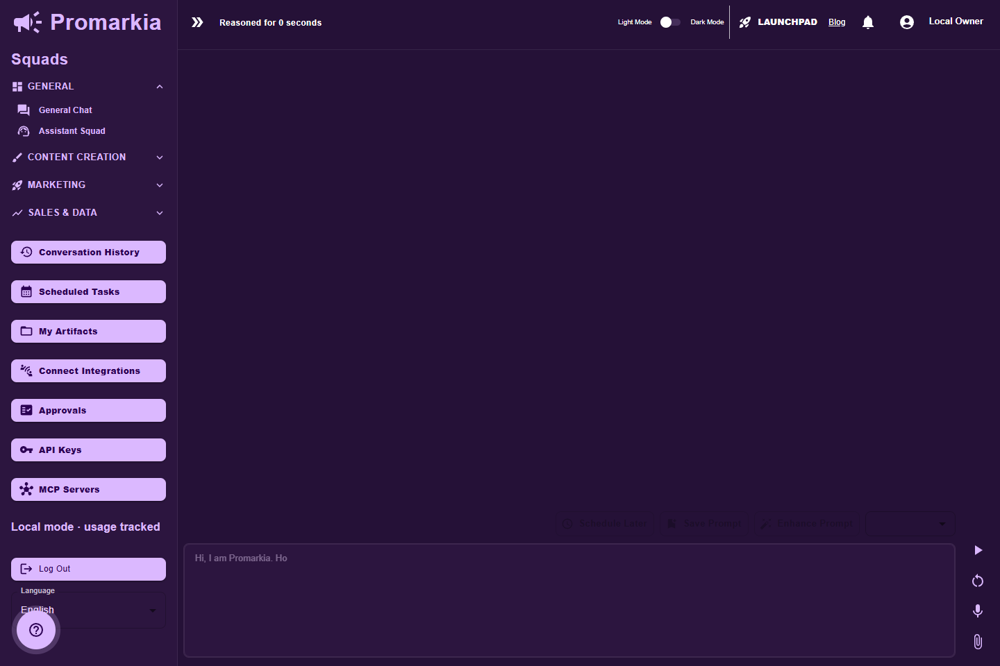
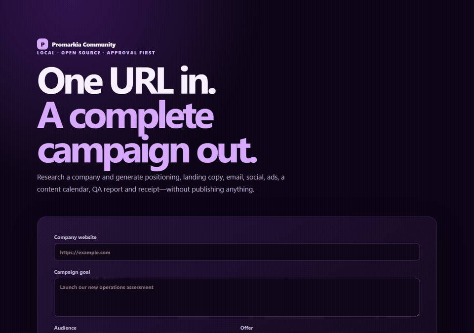

# Promarkia Community

Run the complete core Promarkia workspace on your own computer: general chat, all 15 specialized squads, conversation history, artifacts, recurring tasks, Launchpad workflows, MCP servers, model/provider keys, media creation, connected tools, and approval-first publishing.

Community is the local, single-owner edition. It has no Promarkia subscription, billing, credits, Firebase, Firestore, cloud multi-tenancy, or managed OAuth infrastructure. You supply and pay your chosen AI and integration providers directly.





## Included locally

- General Chat and the Assistant, Image Creator, Video, Social Media, Copywriting, SEO, Campaign Planner, Digital Ads, Coders, Data Scientist, Lead Generation, Email Marketing, Analytics, Competitor Intelligence, and Brand Guidelines squads
- interactive multi-agent conversations and squad routing
- local conversation history, run records, uploaded files, and generated artifacts
- OpenAI, Ollama, and OpenAI-compatible model providers
- encrypted local API-key and integration credential storage
- stdio and Streamable HTTP MCP servers
- image, video, research, document, spreadsheet, and browser tools used by the squads
- Gmail, Outlook, WordPress, LinkedIn, Reddit, X, Facebook, Instagram, calendar, CRM, and other BYO connections used by configured tools
- actual send, publish, upload, and create actions behind a fail-closed approval queue
- one-time, hourly, daily, weekly, cron, and randomized recurring schedules
- Launchpad workflow catalogue
- local token/cost ledger, warning threshold, and optional hard cap
- one local owner profile and workspace

External capabilities work only after you configure the required provider account, credentials, connection identifiers, and quotas. Local mode does not create or manage third-party accounts for you.

## Install

### Desktop

Download the current Windows installer or macOS DMG from the repository's Releases page. Preview binaries are unsigned until Windows code-signing and Apple notarization are configured.

### Docker

```bash
docker compose up --build
```

Open <http://127.0.0.1:8788>. Data persists in the `promarkia-data` volume. The published port is loopback-only.

When Ollama runs on the Docker host, configure its base URL as `http://host.docker.internal:11434/v1`.

### Python

Requires Python 3.11 or 3.12 and Node 22 only when rebuilding the frontend.

```bash
python -m venv .venv
# Windows: .venv\Scripts\activate
# macOS/Linux: source .venv/bin/activate
pip install -r requirements.lock
pip install --no-deps -e .
python scripts/build_full_local.py
promarkia serve
```

Open <http://127.0.0.1:8788>.

## First run

1. Open **API Keys**.
2. Choose Ollama, OpenAI, or an OpenAI-compatible endpoint.
3. Configure the model and base URL, store the required key, and test the connection.
4. Choose General Chat or any squad and start a conversation.
5. Add provider accounts under **Connect Integrations** and custom tools under **MCP Servers**.
6. Review every external action under **Approvals**. Approval authorizes one identical action once; later attempts require a new approval.

For a guided walkthrough, see [Local Workspace Tutorial](docs/TUTORIAL.md).

## Approval-first publishing

Promarkia may draft freely, but supported external mutations fail closed. The first attempt creates a redacted local approval request and does not execute. Approve that request in the UI, then retry the same action. A changed payload or later repeat creates a new request.

This guard covers 21 mutation tools, including email, calendar, WordPress, social publishing, document creation, and external-storage writes. It is a safety boundary, not a substitute for reviewing provider permissions and generated content.

For media actions that require a publicly fetchable asset URL, set `PROMARKIA_PUBLIC_ASSET_BASE_URL` to a URL the external provider can reach. The default loopback URL is intentionally private.

## Local data and privacy

The desktop app stores its SQLite databases, encrypted vault key, schedules, conversations, and files under:

- Windows: `%LOCALAPPDATA%\PromarkiaCommunity`
- macOS: `~/Library/Application Support/PromarkiaCommunity`
- Linux: `${XDG_DATA_HOME:-~/.local/share}/PromarkiaCommunity`
- Docker: `/data` in the `promarkia-data` volume

Set `PROMARKIA_DATA_DIR` to override the location. Back up the directory before deleting it. See [PRIVACY.md](PRIVACY.md) for provider data flows.

## Network security

Community is designed for one trusted user and binds to `127.0.0.1` by default. It has no network login screen. Do not expose it to a LAN or the public internet. A non-loopback bind is rejected unless `PROMARKIA_UNSAFE_ALLOW_NETWORK_BIND=1` is explicitly set behind your own authenticated reverse proxy.

See [SECURITY.md](SECURITY.md) for the threat model and reporting process.

## Community versus Cloud

The core workspace and squads run locally. Promarkia Cloud charges for managed operation: hosted identity and workspaces, managed OAuth, infrastructure, upgrades, backups, uptime, queues, and support. Community replaces those cloud services with a single-owner local profile, encrypted local secrets, SQLite, local files, and your own provider accounts.

## CLI

```bash
promarkia serve
promarkia serve --port 8790 --no-browser
promarkia doctor
```

## License

Promarkia Community is MIT-licensed. Third-party notices, exact dependency inventory, license texts, checksums, and a CycloneDX SBOM are included in release bundles.
